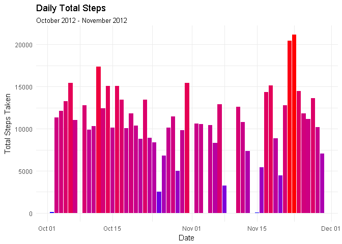
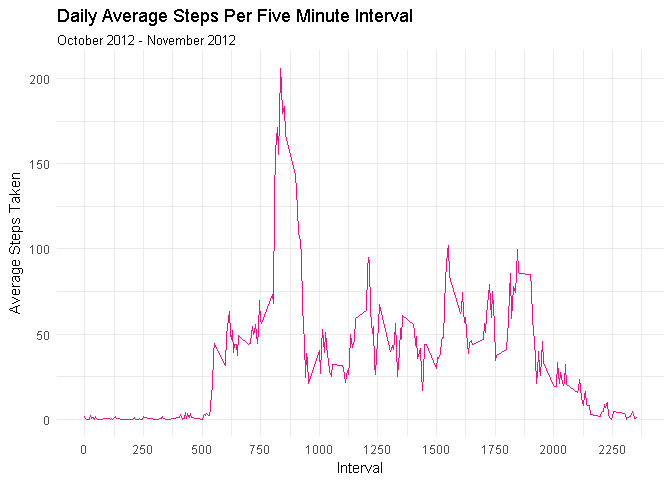
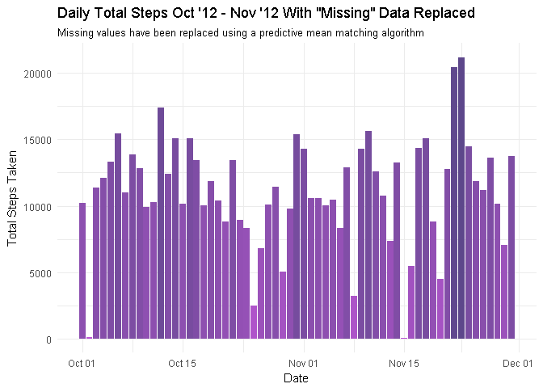
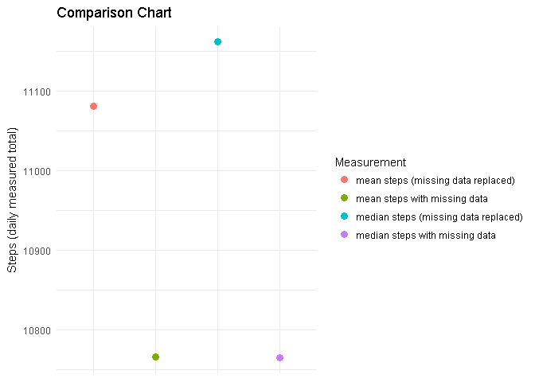
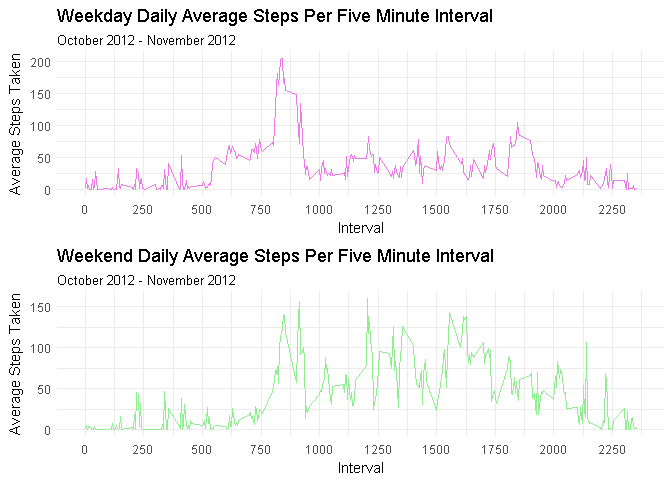
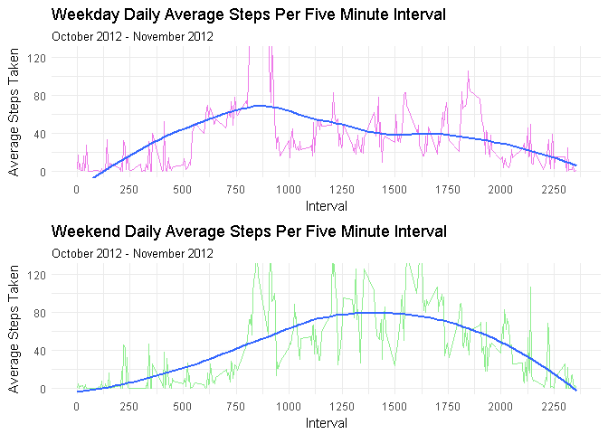

# Reproducible Research Course Project 1
J Joseph  
October 11, 2017  

#Reproducible Research: Course Project 1

 


*"It is now possible to collect a large amount of data about personal movement using activity monitoring devices such as a Fitbit, Nike Fuelband, or Jawbone Up. These type of devices are part of the "quantified self" movement - a group of enthusiasts who take measurements about themselves regularly to improve their health, to find patterns in their behavior, or because they are tech geeks. But these data remain under-utilized both because the raw data are hard to obtain and there is a lack of statistical methods and software for processing and interpreting the data.*

*"This assignment makes use of data from a personal activity monitoring device. This device collects data at 5 minute intervals through out the day. The data consists of two months of data from an anonymous individual collected during the months of October and November, 2012 and include the number of steps taken in 5 minute intervals each day."* - Coursera    


In this analysis we will be creating and providing:

1. Code for reading in the data set and/or processing the data

2. Histogram of the total number of steps taken each day

3. Mean and median number of steps taken each day

4. Time series plot of the average number of steps taken

5. The 5-minute interval that, on average,contains the maximum number of steps

6. Code to describe and show a strategy for imputing missing data

7. Histogram of the total number of steps taken each day after missing values are imputed

8. Panel plot comparing the average number of steps taken per 5-minute interval across weekdays and weekends

9. All of the R code needed to reproduce the results(numbers, plots, etc.) in the report

  

###Load the necessary packages required to conduct the analyis

```r
# Load ggplot2 for creating professional quality graphics 
if (!require("ggplot2")) {
                install.packages("ggplot2")
        }
        library("ggplot2")

# Dplyr for easy data wrangling 
if (!require("dplyr")){
                install.packages("dplyr")
        }
        library("dplyr")

# Readr for smart and efficient data parsing
if (!require("readr")){
                install.packages("readr")
        }
        library("readr")

# Tibble for the easy manipulation of data tables 
if (!require("tibble")) {
                install.packages("tibble")
        }
        library("tibble")
        
# Cowplot to create panel plots easily with ggplot2
if (!require("cowplot")) {
                install.packages("cowplot")
        }
        library("cowplot")
```
### Loading and preprocessing the data


```r
# 1. Read the data into R 
activity_data <- read_csv("activity.csv")
```

```r
# View the structure of the data
str(activity_data)
```

```
## Classes 'tbl_df', 'tbl' and 'data.frame':	17568 obs. of  3 variables:
##  $ steps   : int  NA NA NA NA NA NA NA NA NA NA ...
##  $ date    : Date, format: "2012-10-01" "2012-10-01" ...
##  $ interval: int  0 5 10 15 20 25 30 35 40 45 ...
##  - attr(*, "spec")=List of 2
##   ..$ cols   :List of 3
##   .. ..$ steps   : list()
##   .. .. ..- attr(*, "class")= chr  "collector_integer" "collector"
##   .. ..$ date    :List of 1
##   .. .. ..$ format: chr ""
##   .. .. ..- attr(*, "class")= chr  "collector_date" "collector"
##   .. ..$ interval: list()
##   .. .. ..- attr(*, "class")= chr  "collector_integer" "collector"
##   ..$ default: list()
##   .. ..- attr(*, "class")= chr  "collector_guess" "collector"
##   ..- attr(*, "class")= chr "col_spec"
```


```r
# Preview the data
head(activity_data)
```

```
## # A tibble: 6 x 3
##   steps       date interval
##   <int>     <date>    <int>
## 1    NA 2012-10-01        0
## 2    NA 2012-10-01        5
## 3    NA 2012-10-01       10
## 4    NA 2012-10-01       15
## 5    NA 2012-10-01       20
## 6    NA 2012-10-01       25
```
###What is the average total number of steps taken per day? 


```r
# 1. In order to answer this question we must first sum the total number of steps taken per day. 
steps_per_day <- group_by(activity_data,date) %>% 
                 summarise(steps_per_day = sum(steps)) 
       

print(steps_per_day)
```

```
## # A tibble: 61 x 2
##          date steps_per_day
##        <date>         <int>
##  1 2012-10-01            NA
##  2 2012-10-02           126
##  3 2012-10-03         11352
##  4 2012-10-04         12116
##  5 2012-10-05         13294
##  6 2012-10-06         15420
##  7 2012-10-07         11015
##  8 2012-10-08            NA
##  9 2012-10-09         12811
## 10 2012-10-10          9900
## # ... with 51 more rows
```


```r
# 2. Create a histogram showing the total number of steps taken each day
hist_steps_per_day <- ggplot(steps_per_day, aes(x=date, fill = steps_per_day)) 
                      hist_steps_per_day + 
                      theme_minimal() +
                      geom_histogram(stat = "identity", aes(y = steps_per_day)) +
                      labs(x = "Date", y = "Total Steps Taken", 
                      title = "Daily Total Steps", 
                      subtitle = "October 2012 - November 2012") +
                      scale_fill_gradient(name ="", low = "blue", high = "red") +
                      guides(fill = FALSE)       
```

<!-- -->


```r
# 3. Calculate the median and average total number of steps taken per day
med <- steps_per_day %>% summarise(median_steps_per_day=median(steps_per_day,na.rm= TRUE))

avg <- steps_per_day %>% summarise(mean_steps_per_day = mean(steps_per_day, na.rm = TRUE))

tbl_df(bind_cols(med,avg))
```

```
## # A tibble: 1 x 2
##   median_steps_per_day mean_steps_per_day
##                  <int>              <dbl>
## 1                10765           10766.19
```


###What is the average daily activity pattern?

```r
# 1. Make a time series plot of the 5-minute interval (x-axis) and the average 
# number of steps taken, averaged across all days (y-axis)

# Aggregate the activity data by each 5 minute interval and take the average
interval_average_steps <- group_by(activity_data,interval) %>% 
                          summarize(mean = mean(steps,na.rm = TRUE))

print(interval_average_steps)
```

```
## # A tibble: 288 x 2
##    interval      mean
##       <int>     <dbl>
##  1        0 1.7169811
##  2        5 0.3396226
##  3       10 0.1320755
##  4       15 0.1509434
##  5       20 0.0754717
##  6       25 2.0943396
##  7       30 0.5283019
##  8       35 0.8679245
##  9       40 0.0000000
## 10       45 1.4716981
## # ... with 278 more rows
```


```r
# Create plot
plot_interval_average_steps <- ggplot(interval_average_steps, aes(interval)) 
                               plot_interval_average_steps + 
                               theme_minimal() +       
                               geom_line(stat = "identity", aes(y = mean), 
                               color = "deeppink2") +
                               scale_x_continuous(breaks = seq(0,3000, by = 250)) +
                               labs( x = "Interval", y = "Average Steps Taken", 
                               title = "Daily Average Steps Per Five Minute Interval", 
                               subtitle = "October 2012 - November 2012") 
```

<!-- -->


```r
# 2. Which 5-minute interval during the day, on average across all days in the 
# dataset,contains the maximum number of steps?

# Filter for the interval with the highest average number of steps per day
interval_average_steps %>% filter(., mean == max(mean))
```

```
## # A tibble: 1 x 2
##   interval     mean
##      <int>    <dbl>
## 1      835 206.1698
```

###Imputing missing values

Note that there are a number of days/intervals where there are missing values (coded as `NA`). The presence of missing days may introduce bias into some calculations or summaries of the data.


```r
# 1. Calculate and report the total number of missing values (NA)in the dataset 
sum(is.na(activity_data$steps))        
```

```
## [1] 2304
```


Install and load the `MICE` package to handle the replacement of missing values in the data set


```r
if (!require("mice")){
                install.packages("mice")
        }
        library("mice")
```


```r
# Reload the data as a traditional data frame for compatability with the MICE package 
activity_data <- read.csv("activity.csv")
```


Run the data set through the `MICE` algorithm using `method="pmm"`, predictive mean matching, as the method for imputing missing values


```r
# 2. Impute the missing values
activity_data_none_missing <- mice(data = activity_data, m =1,  method = "pmm", seed = 1)
```


```r
# Confirm that the missing values have been replaced. 
sum(is.na(activity_data_none_missing$steps))
```

```
## [1] 0
```


We will use the `complete` function from the `MICE` package to finalize the imputation of the missing data


```r
# 3. Create a new dataset that is equal to the original dataset but with the missing data filled in.
activity_data_none_missing_tbl <- as_tibble(complete(activity_data_none_missing)) 
```


```r
# Now that it has been confirmed that all missing (na) values have been replaced,
# we will convert its "date" column into the date class for further analysis.
activity_data_none_missing_tbl$date <- as.Date(activity_data_none_missing_tbl$date)               
```


Make a histogram of the total number of steps taken each day and calculate and report the mean and median total number of steps taken per day. Do these values differ from the estimates from the first part of the assignment? What is the impact of imputing missing data on the estimates of the total daily number of steps?


```r
# Aggregate the new data frame by date and sum the total steps taken each day.
steps_per_day_none_missing <- group_by(activity_data_none_missing_tbl,date) %>%
                              summarise( steps_per_day_no_na = sum(steps))
```


```r
# 4. Create histogram showing the total number of steps taken each day.
hist_steps_per_day_none_missing <- ggplot(data = steps_per_day_none_missing, 
                                   aes( x = date, fill = steps_per_day_no_na))
                                   

hist_steps_per_day_none_missing + 
theme_minimal() +
geom_histogram(stat = "identity", 
aes(y = steps_per_day_no_na)) +
scale_fill_gradient(name ="", low = "mediumorchid", high = "mediumpurple4") +
labs(x = "Date", y = "Total Steps Taken",
title = "Daily Total Steps Oct '12 - Nov '12 With \"Missing\" Data Replaced",
subtitle = "Missing values have been replaced using a predictive mean matching algorithm") + 
guides(fill = FALSE)        
```

<!-- -->


```r
# 4.1 Calculate the mean and median of the new data set that contains no missing values
median_steps_no_na <- summarise(steps_per_day_none_missing, median_no_na = 
                      median(steps_per_day_no_na)) 
        
avg_steps_no_na <- summarise(steps_per_day_none_missing, mean_no_na = 
                   mean(steps_per_day_no_na)) 

# View the results
tbl_df(bind_cols(median_steps_no_na,avg_steps_no_na))
```

```
## # A tibble: 1 x 2
##   median_no_na mean_no_na
##          <int>      <dbl>
## 1        11162   11081.54
```

```r
# Compare the original data points (containing NA values) with the new data that 
# contains no missing values
table <- tbl_df(bind_cols(med,median_steps_no_na,avg,avg_steps_no_na))

print(table)
```

```
## # A tibble: 1 x 4
##   median_steps_per_day median_no_na mean_steps_per_day mean_no_na
##                  <int>        <int>              <dbl>      <dbl>
## 1                10765        11162           10766.19   11081.54
```


```r
# Create a plot to visualize the data comparison
comparison_table <- data.frame(value = c(table[[1]],table[[2]],table[[3]],table[[4]]), Measurement =                                  c("median steps with missing data","median steps (missing data replaced)",
                    "mean steps with missing data", "mean steps (missing data replaced)"))

comparison_table_plot <- ggplot(data = comparison_table) 
                         comparison_table_plot + 
                         geom_point(aes(Measurement,value,color = Measurement), size = 3) +  
                         theme_minimal() +
                         labs(y= "Steps (daily measured total)",
                         title = "Comparison Chart") +
                         theme(axis.title.x=element_blank(), axis.text.x=element_blank())
```

<!-- -->


###Are there differences in activity patterns between weekdays and weekends?

```r
# To answer this, lets first add a column to our data set that shows what day of
# the week it was during each observation
activity_data_none_missing_tbl_1 <- add_column(activity_data_none_missing_tbl,weekday 
                                    =weekdays(activity_data_none_missing_tbl$date))

# View the results
head(activity_data_none_missing_tbl_1)
```

```
## # A tibble: 6 x 4
##   steps       date interval weekday
##   <int>     <date>    <int>   <chr>
## 1     0 2012-10-01        0  Monday
## 2     0 2012-10-01        5  Monday
## 3     0 2012-10-01       10  Monday
## 4     0 2012-10-01       15  Monday
## 5     0 2012-10-01       20  Monday
## 6     0 2012-10-01       25  Monday
```


```r
# 1.Now, we will create a new factor variable in the data frame labeling 
# whether each observation took place on a weekday or weekend 
mon_to_fri <- c("Monday","Tuesday","Wednesday","Thursday","Friday")

activity_data_none_missing_tbl_1$category <- ifelse(activity_data_none_missing_tbl_1$weekday %in%
                                              mon_to_fri,"WEEKDAY","WEEKEND") %>%
                                              as.factor()

# View the results
head(activity_data_none_missing_tbl_1)
```

```
## # A tibble: 6 x 5
##   steps       date interval weekday category
##   <int>     <date>    <int>   <chr>   <fctr>
## 1     0 2012-10-01        0  Monday  WEEKDAY
## 2     0 2012-10-01        5  Monday  WEEKDAY
## 3     0 2012-10-01       10  Monday  WEEKDAY
## 4     0 2012-10-01       15  Monday  WEEKDAY
## 5     0 2012-10-01       20  Monday  WEEKDAY
## 6     0 2012-10-01       25  Monday  WEEKDAY
```


Make a panel plot containing a time series plot (i.e. type = "l") of the 5-minute interval (x-axis) and the average number of steps taken, averaged across all weekday days or weekend days (y-axis).

```r
# First, lets begin by creating two new data sets, one containing all the data
# for weekdays, and another for the weekend data
weekday_data <- filter(activity_data_none_missing_tbl_1, category == "WEEKDAY")

weekend_data <- filter(activity_data_none_missing_tbl_1, category == "WEEKEND")
```


```r
# Let's verify that we have separated our weekday data correctly
print(unique(weekday_data$weekday))
```

```
## [1] "Monday"    "Tuesday"   "Wednesday" "Thursday"  "Friday"
```


```r
# Verify that we have also separated the weekend data properly 
print(unique(weekend_data$weekday))
```

```
## [1] "Saturday" "Sunday"
```


```r
# Now that the data has been filtered properly, let's aggregate both data frames 
# by the by the "interval" column, while summarizing the average number of 
# steps taken per interval
weekday_data_mean_summary <- group_by(weekday_data,interval) %>%
                                summarise(mean = mean((steps)))

weekend_data_mean_summary <- group_by(weekend_data,interval) %>%
                                summarise(mean = mean((steps)))
```


```r
# Preview the data
head(weekday_data_mean_summary)
```

```
## # A tibble: 6 x 2
##   interval      mean
##      <int>     <dbl>
## 1        0  2.022222
## 2        5 17.244444
## 3       10  2.400000
## 4       15  7.711111
## 5       20  1.422222
## 6       25  1.311111
```

```r
head(weekend_data_mean_summary)
```

```
## # A tibble: 6 x 2
##   interval   mean
##      <int>  <dbl>
## 1        0 0.6875
## 2        5 5.6250
## 3       10 0.0000
## 4       15 3.6875
## 5       20 2.5000
## 6       25 3.2500
```


```r
# 2. Create plots (interval on the "x" axis, average steps taken on "y" axis)
weekday_plot <- ggplot(data = weekday_data_mean_summary) +
                geom_line(mapping = aes(x = interval, y = mean)
                ,size = .5, color = "orchid2") + 
                theme_minimal() +
                scale_x_continuous(breaks = seq(0,3000, by = 250)) +
                labs( x = "Interval", y = "Average Steps Taken", 
                title = "Weekday Daily Average Steps Per Five Minute Interval", 
                subtitle = "October 2012 - November 2012")

weekend_plot <- ggplot(data = weekend_data_mean_summary) +
                geom_line(mapping = aes(x = interval, y = mean)
                ,size = .5, color = "palegreen2") + 
                theme_minimal() +
                scale_x_continuous(breaks = seq(0,3000, by = 250)) +
                labs( x = "Interval", y = "Average Steps Taken", 
                title = "Weekend Daily Average Steps Per Five Minute Interval", 
                subtitle = "October 2012 - November 2012")

plot_grid(weekday_plot,weekend_plot,  ncol = 1, align = 'V')
```

<!-- -->


Let's zoom in on the plots and add a smoothed average to get a better feel and comparison of the data


```r
# 2. Create plots (interval on the "x" axis, average steps taken on "y" axis)
weekday_plot <- ggplot(data = weekday_data_mean_summary) +
                geom_line(mapping = aes(x = interval, y = mean)
                ,size = .5, color = "orchid2") + 
                theme_minimal() +
                scale_x_continuous(breaks = seq(0,3000, by = 250)) +
                labs( x = "Interval", y = "Average Steps Taken", 
                title = "Weekday Daily Average Steps Per Five Minute Interval", 
                subtitle = "October 2012 - November 2012") +
                geom_smooth( aes(x = interval, y = mean), se = FALSE) +
                coord_cartesian(ylim = c(0,125))

weekend_plot <- ggplot(data = weekend_data_mean_summary) +
                geom_line(mapping = aes(x = interval, y = mean)
                ,size = .5, color = "palegreen2") + 
                theme_minimal() +
                scale_x_continuous(breaks = seq(0,3000, by = 250)) +
                labs( x = "Interval", y = "Average Steps Taken", 
                title = "Weekend Daily Average Steps Per Five Minute Interval", 
                subtitle = "October 2012 - November 2012") +
                geom_smooth( aes(x = interval, y = mean), se = FALSE) +
                coord_cartesian(ylim = c(0,125))
        
plot_grid(weekday_plot,weekend_plot,  ncol = 1, align = 'V')
```

<!-- -->


Looking at the above plots, we can see clearly that on weekdays the average number of steps taken rises quickly early on in the day, but then begins to taper off. On weekends, while the average number of steps is slow to rise during the beginning of the day, the sustained average number of steps as we advance to greater time intervals is more than that of weekdays.  
